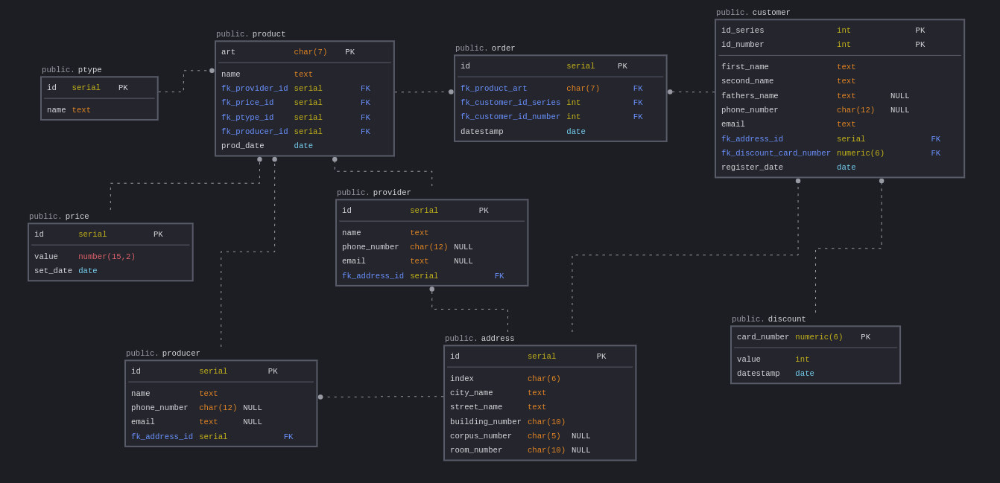

# **Введение**

Цель лабораторной работы создать первый проект базы данных, познакомиться с инструментами управления версиями, языком разметки markdown.

# **Схема базы данных**

Схема базы данных представлена на картинке ниже

# **Краткое описание базы данных**

В базе данных созданы 9 таблиц:

* ptype

    Содержит информацию о категории продукта.
    | Поле   | Описание                                                   |
    | ------ | ---------------------------------------------------------- |
    | id     | Номер. Автоинкрементируемое значение, первичный ключ       |
    | name   | Наименование категории продукта                            |

* product

    Содержит информацию обо всех продуктах магазина
    | Поле           | Описание                         |
    | -------------- | ---------------------------------|
    | art            | Номер артикула, первичный ключ   |
    | name           | Наименование продукта            |
    | fk_provider_id | Поставщик товара                 |
    | fk_price_id    | Стоимость товара                 |
    | fk_ptype_id    | Категория продукта               |
    | fk_producer_id | Производитель товара             |
    | prod_date      | Дата производства продукта       |

* order

    Информация о заказах
    | Поле                  | Описание                                                    |
    | --------------------- | ----------------------------------------------------------- |
    | id                    | Номер заказа. Автоинкрементируемое значение, первичный ключ |
    | fk_product_art        | Артикул товара                                              |
    | fk_customer_id_series | Серия документа покупателя                                  |
    | fk_customer_id_number | Номер документа покупателя                                  |
    | datestamp             | Дата оформления заказа                                      |

* customer

    Информация о покупателях
    | Поле                    | Описание                                   |
    | ----------------------- | ------------------------------------------ |
    | id_series               | Серия документа покупателя, первичный ключ |
    | id_number               | Номер документа покупателя, первичный ключ |
    | first_name              | Имя покупателя                             |
    | second_name             | Фамилия покупателя                         |
    | fathers_name            | Отчество (если есть)                       |
    | phone_number            | Номер телефона покупателя                  |
    | email                   | Адрес электронной почты покупателя         |
    | fk_address_id           | Почтовый адрес покупателя                  |
    | fk_discount_card_number | Номер дисконтной карты                     |
    | register_date           | Дата регистрации с магазине                |

* price

    Информация о ценах на товары
    | Поле     | Описание                                             |
    | -------- | ---------------------------------------------------- |
    | id       | Номер. Автоинкрементируемое значение, первичный ключ |
    | value    | Цена товара                                          |
    | set_date | Дата установки цены                                  |

* provider

    Информация о поставщиках
    | Поле          | Описание                                             |
    | ------------- | ---------------------------------------------------- |
    | id            | Номер. Автоинкрементируемое значение, первичный ключ |
    | name          | Наименование поставщика                              |
    | phone_number  | Номер телефона поставщика                            |
    | email         | Адрес электронной почты поставщика                   |
    | fk_address_id | Почтовый адрес поставщика                            |    

* producer

    Информация о производителях товаров
    | Поле          | Описание                                             |
    | ------------- | ---------------------------------------------------- |
    | id            | Номер. Автоинкрементируемое значение, первичный ключ |
    | name          | Наименование производителя                           |
    | phone_number  | Номер телефона производителя                         |
    | email         | Адрес электронной почты производителя                |
    | fk_address_id | Почтовый адрес производителя                         |

* address

    | Поле            | Описание                                             |
    | --------------- | ---------------------------------------------------- |
    | id              | Номер. Автоинкрементируемое значение, первичный ключ |
    | index           | Почтовый индекс                                      |
    | city_name       | Название города                                      |
    | street_name     | Название улицы                                       |
    | building_number | Номер дома                                           |
    | corpus_number   | Номер корпуса                                        |
    | room_number     | Номер квартиры                                       |

* discount

    | Поле        | Описание                    |
    | ----------- | --------------------------- |
    | card_number | Номер карты, первичный ключ |
    | value       | Уровень скидки              |
    | datestamp   | Дата создания карты         |

# **Рекомендации по репликации и резервному копированию**

Пока рекомендаций нет