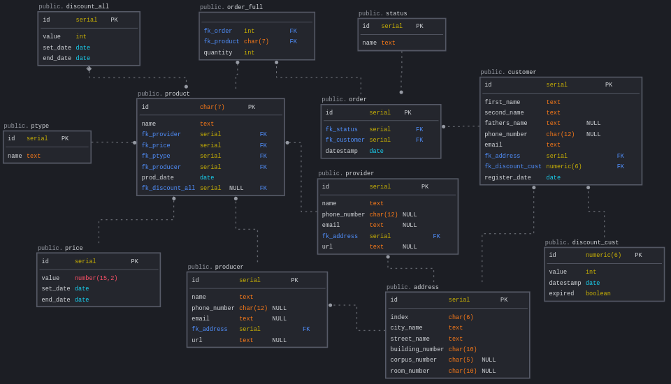

# **Введение**

Цель лабораторной работы научиться применять индексы, анализировать необходимость создания дополнительных индексов и ограничений.



## **1. Провести анализ возможных запросов\отчетов\поиска данных.**

Поскольку это база данных интернет магазина, то очевидно, что наиболее частой задачей будет поиск товаров по наименованию, производителю и цене. Также, скорее всего, будут запросы по статусу заказов, заказчикам и адресам заказчиков. Для отчётов и статистики потребуются запросы по товарам, ценам, поставщикам, производителям, заказам, заказчикам и их дисконтным картам.

## **2. Выяснить возможную кардинальность полей.**

* ptype

    Содержит информацию о категории продукта.
    | Поле   | Описание                                                   |
    | ------ | ---------------------------------------------------------- |
    | id     | Номер. Автоинкрементируемое значение, первичный ключ       |
    | name   | Наименование категории продукта                            |

    Кардинальность полей низкая. Не предполагается большое количество записей.

* product

    Содержит информацию обо всех продуктах магазина
    | Поле           | Описание                         |
    | -------------- | ---------------------------------|
    | id             | Номер артикула, первичный ключ   |
    | name           | Наименование продукта            |
    | fk_provider    | Поставщик товара                 |
    | fk_price       | Стоимость товара                 |
    | fk_ptype       | Категория продукта               |
    | fk_producer    | Производитель товара             |
    | prod_date      | Дата производства продукта       |
    | fk_discount_all| Общая скидка на товар            |

    Поле с высокой кардинальностью *name*.

* discount_all

    Содержит размер скидки на товар, начало действия и окончание
    | Поле        | Описание                                                    |
    | ----------- | ----------------------------------------------------------- |
    | id          | Номер уровня. Автоинкрементируемое значение, первичный ключ |
    | value       | Уровень скидки                                              |
    | set_date    | Начало действия                                             |
    | end_date    | Окончание действия                                          |

    Кардинальность полей низкая. Не предполагается большое количество записей.

* status

    Статус заказа
    | Поле         | Описание                                                     |
    | ------------ | ------------------------------------------------------------ |
    | id           | Номер статуса. Автоинкрементируемое значение, первичный ключ |
    | name         | Наименование                                                 |

    Кардинальность полей низкая. Не предполагается большое количество записей.
    
* order_full

    Содержит связь между заказом и товарами
    | Поле                  | Описание                   |
    | --------------------- | -------------------------- |
    | fk_order              | Номер заказа               |
    | fk_product            | Товар                      |
    | quantity              | Количество товара с заказе |

    Поля с высокой кардинальностью *fk_order, fk_product*.

* order

    Информация о заказах
    | Поле                  | Описание                                                    |
    | --------------------- | ----------------------------------------------------------- |
    | id                    | Номер заказа. Автоинкрементируемое значение, первичный ключ |
    | fk_status             | Статус заказа                                               |
    | fk_customer           | Покупатель                                                  |
    | datestamp             | Дата оформления заказа                                      |

    Поля с высокой кардинальностью *fk_customer, datestamp*.

* customer

    Информация о покупателях
    | Поле                    | Описание                                                        |
    | ----------------------- | --------------------------------------------------------------- |
    | id                      | Номер покупателя. Автоинкрементируемое значение, первичный ключ |
    | first_name              | Имя покупателя                                                  |
    | second_name             | Фамилия покупателя                                              |
    | fathers_name            | Отчество (если есть)                                            |
    | phone_number            | Номер телефона покупателя                                       |
    | email                   | Адрес электронной почты покупателя                              |
    | fk_address              | Почтовый адрес покупателя                                       |
    | fk_discount_cust        | Номер дисконтной карты                                          |
    | register_date           | Дата регистрации с магазине                                     |

    Поля с высокой кардинальностью *second_name, phone_number, email, fk_address, fk_discount_cust, register_date*.

* price

    Информация о ценах на товары
    | Поле     | Описание                                             |
    | -------- | ---------------------------------------------------- |
    | id       | Номер. Автоинкрементируемое значение, первичный ключ |
    | value    | Цена товара                                          |
    | set_date | Дата установки цены                                  |
    | end_date | Дата окончания действия цены                         |

    Поле с высокой кардинальностью *value*.

* provider

    Информация о поставщиках
    | Поле          | Описание                                             |
    | ------------- | ---------------------------------------------------- |
    | id            | Номер. Автоинкрементируемое значение, первичный ключ |
    | name          | Наименование поставщика                              |
    | phone_number  | Номер телефона поставщика                            |
    | email         | Адрес электронной почты поставщика                   |
    | fk_address    | Почтовый адрес поставщика                            | 
    | url           | Адрес сайта                                          |

    Поля с высокой кардинальностью *name, phone_number, email, fk_address, url*.

* producer

    Информация о производителях товаров
    | Поле          | Описание                                             |
    | ------------- | ---------------------------------------------------- |
    | id            | Номер. Автоинкрементируемое значение, первичный ключ |
    | name          | Наименование производителя                           |
    | phone_number  | Номер телефона производителя                         |
    | email         | Адрес электронной почты производителя                |
    | fk_address    | Почтовый адрес производителя                         |
    | url           | Адрес сайта                                          |

    Поля с высокой кардинальностью *name, phone_number, email, fk_address, url*.

* address

    | Поле            | Описание                                             |
    | --------------- | ---------------------------------------------------- |
    | id              | Номер. Автоинкрементируемое значение, первичный ключ |
    | index           | Почтовый индекс                                      |
    | city_name       | Название города                                      |
    | street_name     | Название улицы                                       |
    | building_number | Номер дома                                           |
    | corpus_number   | Номер корпуса                                        |
    | room_number     | Номер квартиры                                       |

    Поля с высокой кардинальностью *city_name, street_name, index*.

* discount_cust

    | Поле        | Описание                    |
    | ----------- | --------------------------- |
    | id          | Номер карты, первичный ключ |
    | value       | Уровень скидки              |
    | datestamp   | Дата создания карты         |
    | expired     | Срок действия истёк         |

    Поле с высокой кардинальностью *datestamp*.
 
## **3. Создать дополнительные индексы - простые или композитные.**

Дополнительные индексы будем создавать для таблиц, у которых есть поля с высокой кардинальностью:
```
CREATE INDEX idx_product_name ON product (name);
CREATE INDEX idx_order_full_fk_order ON order_full (fk_order);
CREATE INDEX idx_order_fk_customer ON order (fk_customer);
CREATE INDEX idx_customer_second_name_first_name ON customer (second_name, first_name);
CREATE INDEX idx_price_value ON price (value);
CREATE INDEX idx_provider_name ON provider (name);
CREATE INDEX idx_producer_name ON producer (name);
CREATE INDEX idx_address_street_name_city_name ON address (street_name, city_name);
CREATE INDEX idx_discount_cust_datestamp ON discount_cust (datestamp);
```

## **4. Краткое описание индексов. Зачем нужны, почему по этому полю\полям.**

Создание дополнительные индексов планировались из учёта того, поиск по каким полям возможен при осуществлении заказа или составлении отчёта.
- Для таблицы product предполагается наиболее частый поиск по названию (поле name) товара.
- В таблице order_full наиболее частый поиск по номеру заказа (поле fk_order) для просмотра состава заказа.
- В таблице order частый запрос возможен по заказчику (поле fk_customer).
- Таблица customer содержит заказчиков, заказчиков удобно искать по фамилии и имени, будем использовать композитный индекс (поля first_name, second_name).
- В таблице price чаще всего будет интересовать поле value.
- Таблицы provider и producer похожи, поиск по наименованию поставщика или производителя, простой индекс по полю name.
- Таблица address композитный индекс по полям street_name и city_name, поскольку поиск чаще всего осуществляется по названию города и улицы.
- В таблице discount_cust возможен поиск по дате изготовления дисконтной карты, поле datestamp.

## **5. Определить, какие логические ограничения нужно добавить в БД.**

Поля даты начала действия не должны быть больше полей конца действия. Поле *datestamp* в таблице *order* при добавлении записи не может быть в прошлом, а поле *prod_date* в таблице *product* не может быть в будущем. Поля *phone_number, email, url, corpus_number, room_number, fathers_name* не обязательны к заполнению и могут иметь значение NULL. Поля *order_full.quantity*, *prise.value*, *discount_all.value* и *discount_cust.value* не могут принимать отрицательные значения.

## **6. Создать ограничения по выбранным полям.**
```
CREATE TABLE public.order
(
 id          serial NOT NULL PRIMARY KEY,
 fk_status   serial NOT NULL,
 fk_customer serial NOT NULL,
 datestamp   date NOT NULL, // проверка datestamp >= current_date на бекенде
 FOREIGN KEY ( fk_customer ) REFERENCES public.customer ( id ),
 FOREIGN KEY ( fk_status ) REFERENCES public.status ( id )
);

CREATE TABLE public.order_full
(
 fk_order   int NOT NULL,
 fk_product char(7) NOT NULL,
 quantity   int NOT NULL CHECK ( quantity > 0 ),
 FOREIGN KEY ( fk_order ) REFERENCES public.order ( id ),
 FOREIGN KEY ( fk_product ) REFERENCES public.product ( id )
);

CREATE TABLE public.price
(
 id       serial NOT NULL PRIMARY KEY,
 value    number(15,2) NOT NULL CHECK ( value > 0 ),
 set_date date NOT NULL,
 end_date date NOT NULL CHECK ( end_date >= set_date )
);

CREATE TABLE public.discount_all
(
 id       serial NOT NULL PRIMARY KEY,
 value    int NOT NULL CHECK (value > 0),
 set_date date NOT NULL,
 end_date date NOT NULL CHECK ( end_date >= set_date )
);

CREATE TABLE public.discount_cust
(
 id        numeric(6) NOT NULL PRIMARY KEY,
 value     int NOT NULL CHECK ( value > 0 ),
 datestamp date NOT NULL,
 expired   boolean NOT NULL
);

CREATE TABLE public.product
(
 id              char(7) NOT NULL PRIMARY KEY,
 name            text NOT NULL,
 fk_provider     serial NOT NULL,
 fk_price        serial NOT NULL,
 fk_ptype        serial NOT NULL,
 fk_producer     serial NOT NULL,
 prod_date       date NOT NULL CHECK ( prod_date =<  current_date ),
 fk_discount_all serial NULL,
 FOREIGN KEY ( fk_discount_all ) REFERENCES public.discount_all ( id ),
 FOREIGN KEY ( fk_price ) REFERENCES public.price ( id ),
 FOREIGN KEY ( fk_producer ) REFERENCES public.producer ( id ),
 FOREIGN KEY ( fk_provider ) REFERENCES public.provider ( id ),
 FOREIGN KEY ( fk_ptype ) REFERENCES public.ptype ( id )
);

CREATE TABLE public.producer
(
 id           serial NOT NULL PRIMARY KEY,
 name         text NOT NULL,
 phone_number char(12) NULL,
 email        text NULL,
 fk_address   serial NOT NULL,
 url          text NULL,
 FOREIGN KEY ( fk_address ) REFERENCES public.address ( id )
);

CREATE TABLE public.address
(
 id              serial NOT NULL PRIMARY KEY,
 index           char(6) NOT NULL,
 city_name       text NOT NULL,
 street_name     text NOT NULL,
 building_number char(10) NOT NULL,
 corpus_number   char(5) NULL,
 room_number     char(10) NULL
);
```

Приведены примеры создания некоторых таблиц с ограничениями, остальные таблицы создаются аналогичным или похожим образом.

# **Итог**

В лабораторной работе проведён анализ необходимости создания дополнительных индексов и ограничений. Даны разъяснения и обоснования о выборе полей для индексации и необходимости наложения на них ограничений.