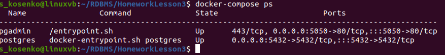
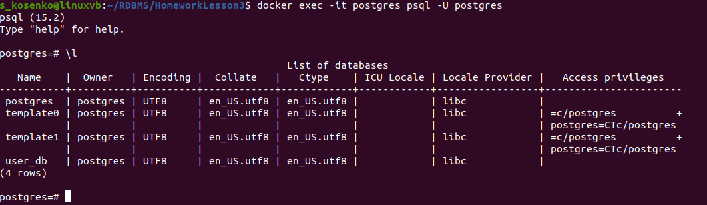
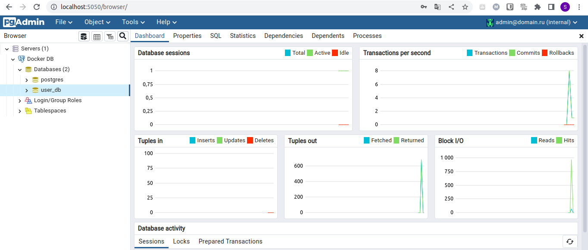
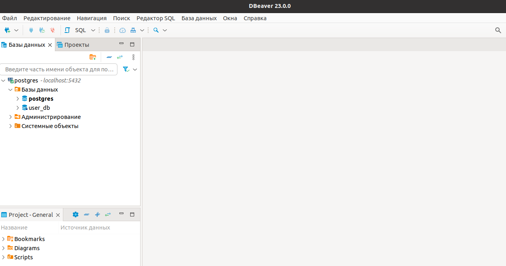

# **Введение**

Цель лабораторной работы cоздать кластер PostgreSQL в докере или на виртуальной машине, запустить сервер и подключить клиента. Для выполнения работы используется ПК с установленной операционной системой Ubuntu 20.04.5 LTS. На ПК уже установлены Docker и Dbeaver.

# **1. Развернуть контейнер с PostgreSQL**

Работа будет выполняться с docker контейнером *postgres:15.2-alpine*. Так же в другом контейнере будет запускаться *pgAdmin*. Для запуска контейнеров создан compose файл:

```
version: '3.1'

volumes:
  db-data: {}

networks:
  pdb:
    driver: bridge

services:
  postgres:
    container_name: postgres
    hostname: postgres
    image: postgres:15.2-alpine
    environment:
      - POSTGRES_USER=postgres
      - POSTGRES_PASSWORD=passdb
      - POSTGRES_DB=user_db
    ports:
      - "5432:5432"
    restart: always
    volumes:
      - db-data:/var/lib/postgresql/data
    networks:
      - pdb

  pgadmin:
    container_name: pgadmin
    hostname: pgadmin
    image: dpage/pgadmin4:latest
    environment:
      - PGADMIN_DEFAULT_EMAIL=admin@domain.ru
      - PGADMIN_DEFAULT_PASSWORD=passdb
    ports:
      - "5050:80"
    restart: always
    networks:
      - pdb
```

# **2. Запустить сервер**

Для запуска контейнеров используем команду:

```
docker-compose up -d
```

Проверим запуск контейнеров:



# **3. Создать клиента с подключением к базе данных postgres через командную строку.**

После запуска контейнера можем запустить *psql* внутри контейнера *postgres* и проверить наличие базы данных, которую мы указали в compose файле:




# **4. Подключиться к серверу используя pgAdmin или другое аналогичное приложение.**

Порт 80 контейнера с запущенным *pgAdmin* проброшен на порт 5050 хостовой машины. Подключимся к Postgresql с помощью *pgAdmin*:



Попробуем подключиться к контейнеру с помощью *Dbeaver*, который установлен на ПК. Подключаться будем на порт 5432 - порт контейнера проброшен на такой же порт хостовой машины:



# **Итог**

СУБД Postgresql была запущена в контейнере docker. Показана возможность подключения к СУБД различными инструментами как графическими, так и cli. Подключение к СУБД осуществлено с помощью инструментов, которые установлены на хостовой системе и в другом контейнере. 