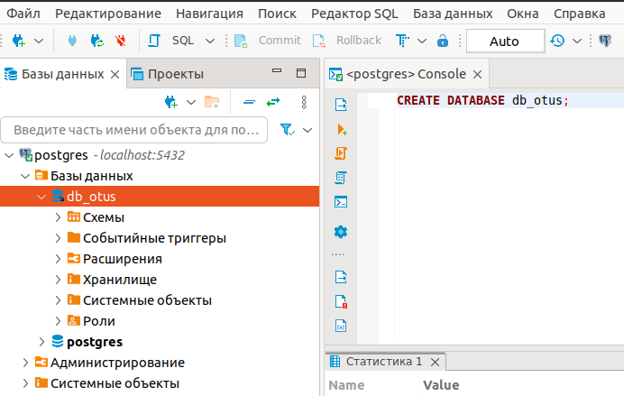
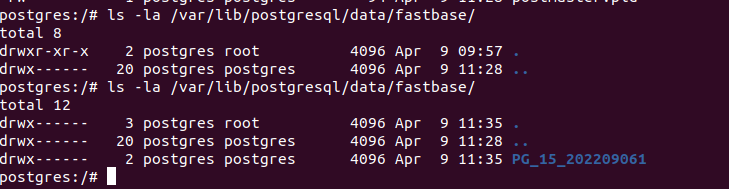
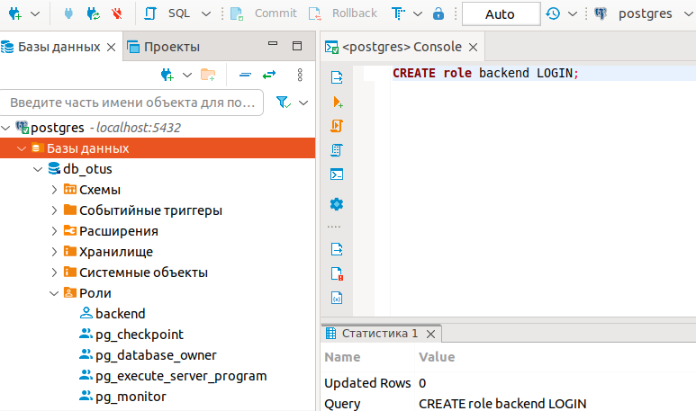
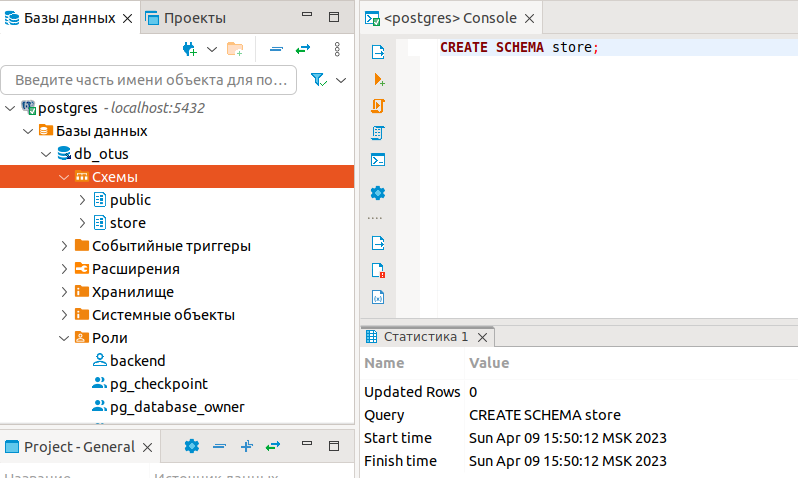

# **Введение**

Цель лабораторной работы получить навыки работы с DDL командами. Необходимо реализовать спроектированную схему в PostgreSQL. Для выполнения работы используется ПК с установленной операционной системой Ubuntu 20.04.5 LTS. На ПК установлены Docker и Dbeaver. PostgreSQL будет запускаться в docker контейнере. DDL команды будут выполняться в Dbeaver.

## **1. Создание базы данных.**

```
CREATE DATABASE db_otus;
```



## **2. Создание табличных пространств и ролей.**

Будем использовать 2 табличных пространства. Табличное пространство fastspace, расположенное в контейнере по пути /var/lib/postgresql/data/fastbase и табличное пространство по-умолчанию (pg_default), расположено по пути /var/lib/postgresql/data/base.

```
CREATE TABLESPACE fastspace LOCATION '/var/lib/postgresql/data/fastbase';
```



Создадим роль `backend`, для возможности подключения приложения к базе данных.

```
CREATE role backend LOGIN;
```



## **3. Создание схемы данных.**

Создадим новую схему

```
CREATE SCHEMA store;
```



Таблицы будем создавать в новой схеме.

## **4. Создание таблиц и их распределение по схемам и табличным пространствам.**

Создадим таблицы в соответствии с описанием из предыдущих работ:

* store.ptype
* store.discount_all
* store.price
* store.address
* store.producer
* store.provider
* store.product
* store.status
* store.discount_cust
* store.customer
* store.order
* store.order_full

```
CREATE TABLE store.ptype
(
 id     int GENERATED BY DEFAULT AS IDENTITY NOT NULL PRIMARY KEY,
 name   varchar(100)
);

CREATE TABLE store.discount_all
(
 id       int GENERATED BY DEFAULT AS IDENTITY NOT NULL PRIMARY KEY,
 value    int NOT NULL CHECK (value > 0),
 set_date date NOT NULL,
 end_date date NOT NULL CHECK (end_date >= set_date)
);

CREATE TABLE store.price
(
 id       int GENERATED BY DEFAULT AS IDENTITY NOT NULL PRIMARY KEY,
 value    numeric(15,4) NOT NULL CHECK (value > 0),
 set_date date NOT NULL,
 end_date date NOT NULL CHECK (end_date >= set_date)
);

CREATE TABLE store.address
(
 id              int GENERATED BY DEFAULT AS IDENTITY NOT NULL PRIMARY KEY,
 index           numeric(6) NOT NULL,
 city_name       text NOT NULL,
 street_name     text NULL,
 building_number char(10) NOT NULL,
 corpus_number   char(5) NULL,
 room_number     char(10) NULL
) TABLESPACE fastspace;

CREATE TABLE store.producer
(
 id           int GENERATED BY DEFAULT AS IDENTITY NOT NULL PRIMARY KEY,
 name         text NOT NULL,
 phone_number char(12) NULL,
 email        varchar(100) NULL,
 fk_address   int NOT NULL,
 url          varchar(100) NULL,
 FOREIGN KEY (fk_address) REFERENCES store.address (id)
);

CREATE TABLE store.provider
(
 id           int GENERATED BY DEFAULT AS IDENTITY NOT NULL PRIMARY KEY,
 name         text NOT NULL,
 phone_number char(12) NULL,
 email        varchar(100) NULL,
 fk_address   int NOT NULL,
 url          varchar(100) NULL,
 FOREIGN KEY (fk_address) REFERENCES store.address (id)
);

CREATE TABLE store.product
(
 id              char(7) NOT NULL PRIMARY KEY,
 name            text NOT NULL,
 fk_provider     int NOT NULL,
 fk_price        int NOT NULL,
 fk_ptype        int NOT NULL,
 fk_producer     int NOT NULL,
 prod_date       date NOT NULL CHECK (prod_date <= current_date),
 fk_discount_all int NULL,
 FOREIGN KEY (fk_discount_all) REFERENCES store.discount_all (id),
 FOREIGN KEY (fk_price) REFERENCES store.price (id),
 FOREIGN KEY (fk_producer) REFERENCES store.producer (id),
 FOREIGN KEY (fk_provider) REFERENCES store.provider (id),
 FOREIGN KEY (fk_ptype) REFERENCES store.ptype (id)
) TABLESPACE fastspace;

CREATE TABLE store.status
(
 id     int GENERATED BY DEFAULT AS IDENTITY NOT NULL PRIMARY KEY,
 name   varchar(100)
);

CREATE TABLE store.discount_cust
(
 id        numeric(6) NOT NULL PRIMARY KEY,
 value     int NOT NULL CHECK (value > 0),
 datestamp date NOT NULL,
 expired   boolean NOT NULL
);

CREATE TABLE store.customer
(
 id               int GENERATED BY DEFAULT AS IDENTITY NOT NULL PRIMARY KEY,
 first_name       text NOT NULL,
 second_name      text NOT NULL,
 fathers_name     text NULL,
 phone_number     char(12) NULL,
 email            varchar(100) NOT NULL,
 fk_address       int NOT NULL,
 fk_discount_cust numeric(6) NOT NULL,
 register_date    date NOT NULL,
 FOREIGN KEY (fk_address) REFERENCES store.address (id),
 FOREIGN KEY (fk_discount_cust) REFERENCES store.discount_cust (id)
) TABLESPACE fastspace;

CREATE TABLE store.order
(
 id          int GENERATED BY DEFAULT AS IDENTITY NOT NULL PRIMARY KEY,
 fk_status   int NOT NULL,
 fk_customer int NOT NULL,
 datestamp   date NOT NULL,
 FOREIGN KEY (fk_customer) REFERENCES store.customer (id),
 FOREIGN KEY (fk_status) REFERENCES store.status (id)
) TABLESPACE fastspace;

CREATE TABLE store.order_full
(
 fk_order   int NOT NULL,
 fk_product char(7) NOT NULL,
 quantity   int NOT NULL CHECK ( quantity > 0 ),
 FOREIGN KEY (fk_order) REFERENCES store.order (id),
 FOREIGN KEY (fk_product) REFERENCES store.product (id)
) TABLESPACE fastspace;
```

# **Итог**
В лабораторной работе с помощью операторов DDL созданы учебная база, схема, табличные пространства, роль. Так же созданы таблицы проекта, которые размещены в разных табличных пространствах, исходя из предполагаемых требований к скорости работы запросов к таблицам.