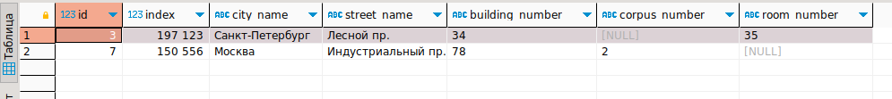

# **Введение**

Цель лабораторной работы научиться создавать различные типы связей между таблицами, добавлять и обновлять данные со сложными выборками, удалять данные с подзапросами. Для выполнения работы используется ПК с установленной операционной системой Ubuntu 22.04.2 LTS. На ПК уже установлены Docker и Dbeaver.

# **1. Запрос с регулярным выражением**

Найдём в таблице адресов все названия улиц, которые начинаются с 'ул.':

```
SELECT * from store.address WHERE street_name LIKE 'ул.%';
```


И записи, которые заканчиваются на 'пр.':

```
SELECT * from store.address WHERE street_name LIKE '% пр.';
```



# **2. Запрос с использованием LEFT JOIN и INNER JOIN**

```
SELECT * from store.address as a left join store.provider as p on p.fk_address=a.id;
```


```
SELECT * from store.provider as p left join store.address as a on p.fk_address=a.id;
```


```
SELECT * from store.address as a inner join store.provider as p on p.fk_address=a.id;
```


```
SELECT * from store.provider as p inner join store.address as a on p.fk_address=a.id;
```


При выполнении LEFT JOIN изменение порядка соединений меняет количество выводимых строк, т.к. от порядка соединений зависит из какой таблицы будут выбраны все значения, а из какой только совпадающие.

При выполнении INNER JOIN изменение порядка соединений влияет только на порядок отображения столбцов, т.к. INNER JOIN отображает только строки с совпадающими значениями.

# **3. Запрос на добавление данных с выводом информации о добавленных строках.**

Добавим новые ценники:

```
INSERT INTO store.price (value, set_date, end_date)
VALUES(345.2300, '2023-04-24', '2023-07-24'),
(1000.8765, '2023-04-15', '2023-06-15')
RETURNING id, value, set_date, end_date;
```


# **4. Запрос с обновлением данных, используя UPDATE FROM.**

Увеличим на 1% размер персональной скидки для клиента с номером телефона '+79045893478':

```
UPDATE store.discount_cust SET value = value + 1 FROM store.customer
  WHERE customer.phone_number = '+79045893478'
  AND discount_cust.id = customer.fk_discount_cust
```

# **5. Запрос для удаления данных с оператором DELETE используя JOIN с другой таблицей с помощью USING.**

Удалим заказы клиента с номером телефона '+70791452932' за '2023-03-27' число:

```
DELETE FROM store.order USING store.customer
  WHERE store.order.fk_customer = customer.id
  AND customer.phone_number = '+70791452932'
  AND store.order.datestamp = '2023-03-27'
```

# **Итог**

При выполнении лабораторной работы на практике применили сложные выборки данных из нескольких таблиц, запросы для удаления и добавления записей.